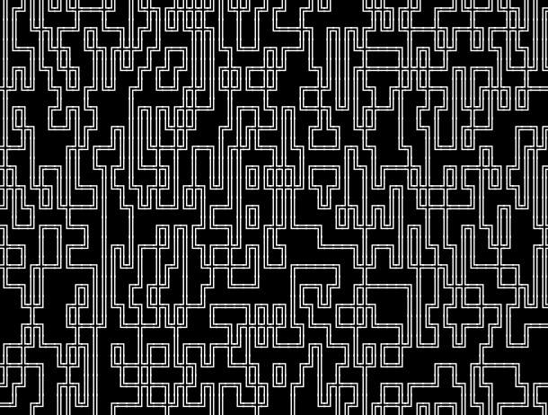
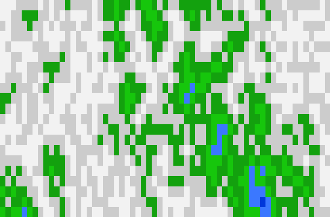
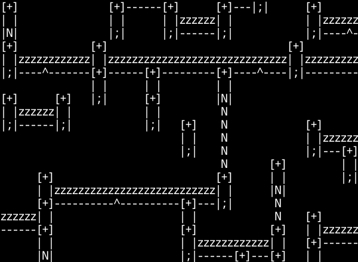
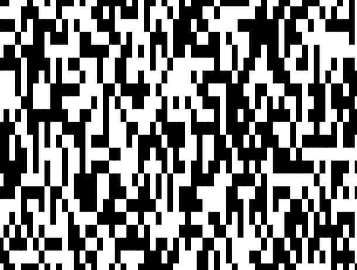

# Wave Function Collapse in Haskell

[Wave function collapse algorithms](https://en.wikipedia.org/wiki/Model_synthesis) are a specific type of constraint-solving algorithm often seen in video games. This is a small-scale set of experiments into implementing one specific version.

## Installation and Usage

This project requires [GHC](https://www.haskell.org/ghc/) and [Cabal](https://www.haskell.org/cabal/). GHC and Cabal come with [GHCup](https://www.haskell.org/ghcup/), which is decidedly *not* necessary but may be easier for your purposes than installing the packages.

To install, use `git clone` and navigate to the cloned directory. To run, invoke `cabal run wavefunction -- tileset width height`.

## Algorithm

The algorithm begins with a grid in which each space is in a "superposition" of every tile in a tileset. A random tile is selected and "collapsed" into one of its possibilities, and then its neighbors prune newly invalid possibilities, and their neighbors, etc. A new random one of the lowest-probability-count tiles is selected and the process continues.

This specific implementation allows validity checks to only be based on the four immediate cardinal neighbors, and allows any tile at the edges of the map.

Each tileset must be equipped with a `pretty` function, which displays a single element as a string, and four cardinal-direction `validators`, which each report whether two tiles may be placed next to each other. Tilesets may optionally alter tile frequencies, rather than evenly weighting every possibility. Tilesets should lawfully implement Eq, Bounded, and Enum.

## Tilesets

### Pipes

### Map

### Castle

### Quad

